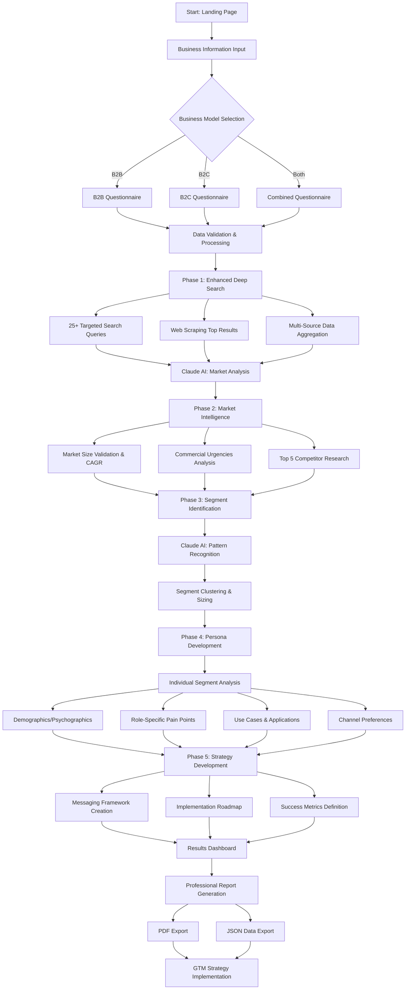

# AI Market Segmentation Web App - Process Documentation

## Overview

The AI Market Segmentation Web App is a comprehensive tool that leverages Claude Sonnet 4 to transform traditional market analysis into an automated, data-driven segmentation process. This document outlines the detailed methodology and workflow for the GTM team.

## Key Benefits for GTM Teams

- **Speed**: Complete market segmentation in 5-10 minutes vs. weeks of manual research
- **Consistency**: Standardized methodology across all product lines and markets
- **Depth**: AI-powered insights combining multiple data sources and frameworks
- **Competitive Intelligence**: Real-time competitor analysis with funding and positioning data
- **Role-Based Targeting**: Specific pain points mapped to business roles and stakeholders
- **Market Dynamics**: Industry growth factors, CAGR, and commercial urgencies
- **Actionability**: Ready-to-implement personas with messaging and channel recommendations
- **Documentation**: Professional reports for stakeholder alignment and strategy documentation

## Process Flow

## Detailed Process Breakdown

### Phase 1: Data Collection & Market Research

#### 1.1 Business Information Gathering
**Duration**: 3-5 minutes  
**Responsible**: GTM Team Member

**Basic Information Collected**:
- Company/Product name
- Industry category
- Business model (B2B/B2C/Both)
- Business description and value proposition

**B2B Specific Data**:
- Target company sizes (Startup → Enterprise)
- Target industries and verticals
- Deal size ranges and sales cycle length
- Decision maker roles and stakeholders
- Geographic focus areas
- Primary pain points and use cases

**B2C Specific Data**:
- Target demographics (age, gender, income)
- Geographic markets
- Product categories and purchase frequency
- Customer motivations and lifestyle preferences
- Psychographic characteristics

#### 1.2 Enhanced Deep Search & Market Research
**Duration**: 30-60 seconds  
**Responsible**: AI System with Serper.dev Integration

**Advanced Search Capabilities**:
- **25+ Targeted Searches**: Comprehensive query coverage across multiple categories
- **Web Scraping**: Full-page content extraction from authoritative sources
- **Parallel Processing**: Concurrent search execution for speed
- **Quality Scoring**: Confidence metrics for all data points
- **Relevance Validation**: Industry-specific keyword matching

**Search Categories**:
- Market size and TAM analysis with validation
- Customer segments and demographics research
- Competitor landscape and funding data
- Industry trends and growth factors
- Academic research and industry reports

**Data Quality Metrics**:
- Overall quality score with confidence levels
- Source authority validation
- Recency checks (prioritizing 2024-2025 data)
- Market size sanity checks and validation
- Relevance scoring for industry alignment

### Phase 2: Enhanced Market Intelligence

#### 2.1 Market Landscape Assessment
**Duration**: 45-90 seconds  
**AI Model**: Claude Sonnet 4

**Analysis Includes**:
- Total Addressable Market (TAM) estimation with growth projections
- Key market insights and opportunities
- Industry trends affecting the business
- **Industry Growth Factors**: Technology drivers, regulatory changes, consumer behavior shifts
- **Industry CAGR**: Compound Annual Growth Rate with 5-year projections
- **Commercial Urgencies**: Current market pressures and timing factors
- Market maturity and growth potential

#### 2.2 Competitive Intelligence Analysis
**Duration**: 30-45 seconds  
**AI Model**: Claude Sonnet 4

**Deep Competitive Research**:
- **Top 5 Competitors**: Comprehensive competitor profiles including:
  - Company names and market positioning
  - Funding status, amounts, and investment stages
  - Solution specialties and differentiation
  - Market share and competitive advantages
- Competitive landscape overview and market gaps
- Competitive threats and opportunities

### Phase 3: Segment Identification & Clustering
**Duration**: 1-2 minutes  
**AI Model**: Claude Sonnet 4

**Process**:
1. **Pattern Recognition**: AI analyzes all collected data to identify distinct customer patterns
2. **Behavioral Clustering**: Groups customers based on similar behaviors, needs, and characteristics
3. **Market Sizing**: Estimates the size and value of each identified segment
4. **Segment Validation**: Ensures segments are distinct, measurable, and actionable

**Output**: 4-6 distinct market segments with:
- Creative, memorable segment names
- Key defining characteristics
- Market size estimation (% of TAM)
- Primary pain points
- Buying triggers and motivations
- Preferred communication channels
- Initial messaging hooks
- **Use Cases**: Specific practical applications and scenarios
- **Role-Specific Pain Points**: Pain points mapped to business roles (B2B)

### Phase 4: Detailed Persona Development

#### 3.1 Individual Segment Deep-Dive
**Duration**: 2-3 minutes  
**AI Model**: Claude Sonnet 4

For each identified segment, the AI creates:

**Demographic/Firmographic Profiles**:
- Detailed demographic breakdowns (B2C)
- Company profiles and roles (B2B)
- Geographic distribution
- Education and experience levels

**Psychographic Analysis**:
- Values and attitudes
- Lifestyle preferences
- Decision-making patterns
- Information consumption habits
- Trust factors and influences

**Behavioral Insights**:
- Purchase decision process
- Channel preferences and usage
- Content consumption patterns
- Communication style preferences

### Phase 5: Go-to-Market Strategy Development

#### 4.1 Messaging Framework Creation
**Duration**: 1-2 minutes  
**AI Model**: Claude Sonnet 4

**Components**:
- Value proposition for each segment
- Key messaging pillars
- Compelling messaging hooks
- Pain point-specific communications
- Benefit-focused value statements

#### 4.2 Implementation Roadmap Development
**Process**: Automated based on segment analysis

**90-Day Implementation Plan**:
- **Phase 1 (0-30 days)**: Primary segment focus and foundation
- **Phase 2 (30-60 days)**: Secondary segment expansion and optimization
- **Phase 3 (60-90 days)**: Full segment activation and scale

**Quick Wins Identification**:
- Immediate opportunities for impact
- Low-effort, high-return initiatives
- Channel-specific tactics
- Messaging optimizations

#### 4.3 Success Metrics Definition
**Metrics Categories**:
- **Segment-Specific KPIs**: Conversion rates, engagement metrics
- **Business Model Metrics**: 
  - B2B: SQLs, pipeline velocity, deal size
  - B2C: CLV, repeat purchase rate, AOV
- **Channel Effectiveness**: Performance by communication channel
- **Message-Market Fit**: Resonance and response metrics

### Phase 6: Results Presentation & Export

#### 6.1 Interactive Dashboard
**Features**:
- Market overview with TAM and key insights
- **Enhanced Market Intelligence** section with:
  - Industry growth factors and CAGR
  - Commercial urgencies and market pressures
  - Top 5 competitor analysis with funding data
- Segment distribution visualization (pie charts, bar graphs)
- Detailed segment cards with expandable information including:
  - Use cases and practical applications
  - Role-specific pain points mapping
- Implementation priority matrix
- Success metrics tracking framework

#### 6.2 Professional Report Generation
**PDF Report Sections**:
1. **Executive Summary**: Key findings and recommendations
2. **Enhanced Market Analysis**: 
   - Industry trends and competitive landscape
   - Industry growth factors and CAGR projections
   - Commercial urgencies and market timing
   - Top 5 competitor analysis with funding and positioning
3. **Segment Profiles**: Detailed breakdown of each segment including:
   - Demographics and psychographics
   - Use cases and practical applications
   - Role-specific pain points (B2B segments)
   - Messaging frameworks and channel preferences
4. **Implementation Roadmap**: Phased approach with timelines
5. **Success Metrics**: KPIs and measurement framework
6. **Appendix**: Methodology and data sources

#### 6.3 Data Export Options
- **JSON Export**: Machine-readable data for CRM integration
- **Implementation Checklists**: Actionable task lists
- **Campaign Briefs**: Ready-to-use creative and messaging guides

## Technical Architecture

### AI Components
- **Primary AI**: Claude Sonnet 4 (claude-3-5-sonnet-20241022)
- **Enhanced Search**: Serper.dev API with 25+ queries per analysis
- **Web Scraping**: Intelligent content extraction from search results
- **Data Processing**: Multi-layer validation and confidence scoring
- **Market Validation**: Sanity checks for market size and growth rates

### Search & Data Quality
- **Search Volume**: 25+ targeted queries across 5 categories
- **Data Sources**: 20+ authoritative sources per analysis
- **Content Analysis**: 50,000+ characters of deep content extraction
- **Confidence Scoring**: Multi-factor validation for all data points
- **Industry Relevance**: Dynamic keyword matching for accuracy

### AI Analysis Transparency
- **Real-time Progress**: Detailed visibility into each analysis phase
- **Search Statistics**: Queries executed, sources analyzed, pages scraped
- **AI Methodology**: Expandable explanations of AI processes
- **Quality Metrics**: Data quality scores and confidence levels
- **Timing Analytics**: Performance metrics for each phase

### Output Quality Assurance
- **Market Size Validation**: Prevents unrealistic values (e.g., trillions for niche markets)
- **Growth Rate Limits**: Caps at reasonable percentages (100% max)
- **Relevance Filtering**: Industry-specific keyword validation
- **Confidence Levels**: High/Medium/Low ratings for market data
- **Error Recovery**: Automatic retry logic for failed processes

## Best Practices for GTM Teams

### 1. Input Quality
- **Be Specific**: Detailed business descriptions yield better segments
- **Include Context**: Mention current challenges and growth goals
- **Geographic Clarity**: Specify primary and secondary markets
- **Competitive Awareness**: Note key competitors if known

### 2. Results Interpretation
- **Validate Segments**: Cross-reference with existing customer data
- **Test Assumptions**: Use generated personas for customer interviews
- **Iterate Messaging**: A/B test recommended messaging hooks
- **Monitor Performance**: Track suggested success metrics

### 3. Implementation Strategy
- **Start Small**: Focus on primary segment first
- **Document Learnings**: Track what works and what doesn't
- **Cross-Functional Alignment**: Share results with sales, marketing, and product teams
- **Regular Updates**: Refresh segmentation quarterly or after major product changes

## Integration with Existing GTM Processes

### CRM Integration
- Import segment data into existing CRM systems
- Create custom fields for segment tracking
- Set up automated scoring based on segment characteristics

### Campaign Development
- Use generated messaging hooks for ad copy development
- Apply channel preferences for media planning
- Leverage pain points for content marketing strategy

### Sales Enablement
- Train sales teams on segment-specific approaches
- Develop segment-based sales materials
- Create qualification frameworks based on segment characteristics

## ROI and Success Measurement

### Time Savings
- **Traditional Process**: 2-4 weeks for manual market research and segmentation
- **AI Process**: 5-10 minutes for comprehensive analysis including competitive intelligence
- **Efficiency Gain**: 95%+ time reduction

### Quality Improvements
- **Consistency**: Standardized methodology across all analyses
- **Depth**: Multi-dimensional analysis including role mapping and use cases
- **Competitive Intelligence**: Real-time competitor funding and positioning data
- **Market Dynamics**: Industry growth factors and commercial urgencies
- **Objectivity**: AI-driven insights reduce human bias

### Business Impact Metrics
- **Faster Time-to-Market**: Accelerated campaign development
- **Improved Targeting**: Higher conversion rates from better segmentation
- **Resource Optimization**: More efficient allocation of marketing spend
- **Strategic Alignment**: Clear, documented strategy for team alignment

## Troubleshooting Common Issues

### Low Segment Quality
- **Solution**: Provide more detailed business description
- **Check**: Ensure target market information is specific
- **Validate**: Cross-reference with known customer data

### Segment Overlap
- **Review**: Check if business model selection was accurate
- **Refine**: Provide additional differentiating factors
- **Iterate**: Run analysis with more specific parameters

### Implementation Challenges
- **Start Simple**: Focus on one segment and one channel
- **Measure Early**: Set up tracking before campaign launch
- **Iterate Quickly**: Use feedback to refine approach

## Future Enhancements

### Planned Features
- **Real-time Data Integration**: Live market data feeds
- **Enhanced Competitive Intelligence**: Automated competitor monitoring with funding alerts
- **Performance Tracking**: Integrated analytics dashboard with role-based metrics
- **Collaborative Features**: Team sharing and commenting on segments
- **API Integration**: Direct connection to marketing automation platforms
- **Advanced Role Mapping**: Deeper organizational hierarchy analysis

### Advanced Capabilities
- **Predictive Modeling**: Forecast segment evolution and growth
- **Dynamic Segmentation**: Real-time segment updates based on market changes
- **Cross-Market Analysis**: Multi-geography comparisons with local competitors
- **Longitudinal Tracking**: Segment performance over time with CAGR correlation
- **Competitive Benchmarking**: Ongoing competitor funding and positioning tracking

---

*This documentation provides GTM teams with a comprehensive understanding of the AI Market Segmentation process, enabling effective strategy development and implementation.*